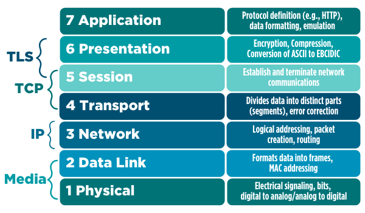
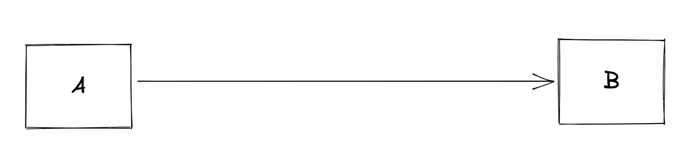
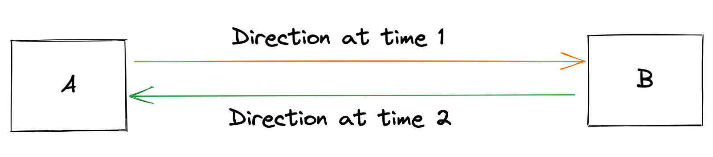
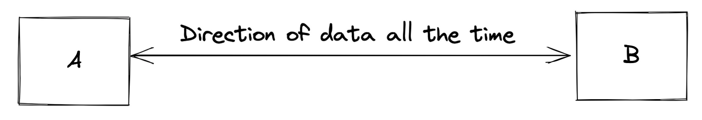
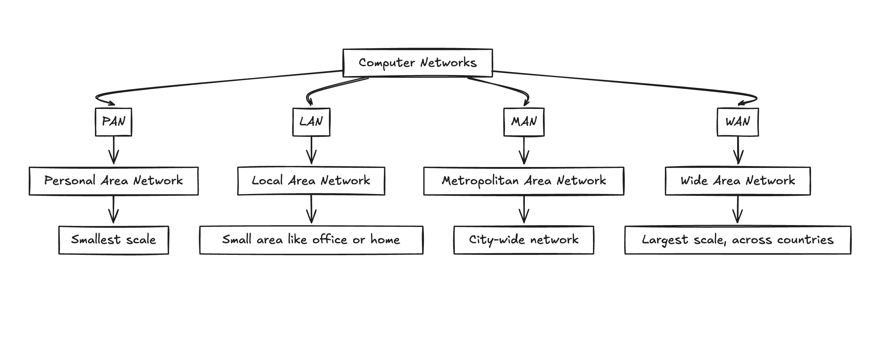
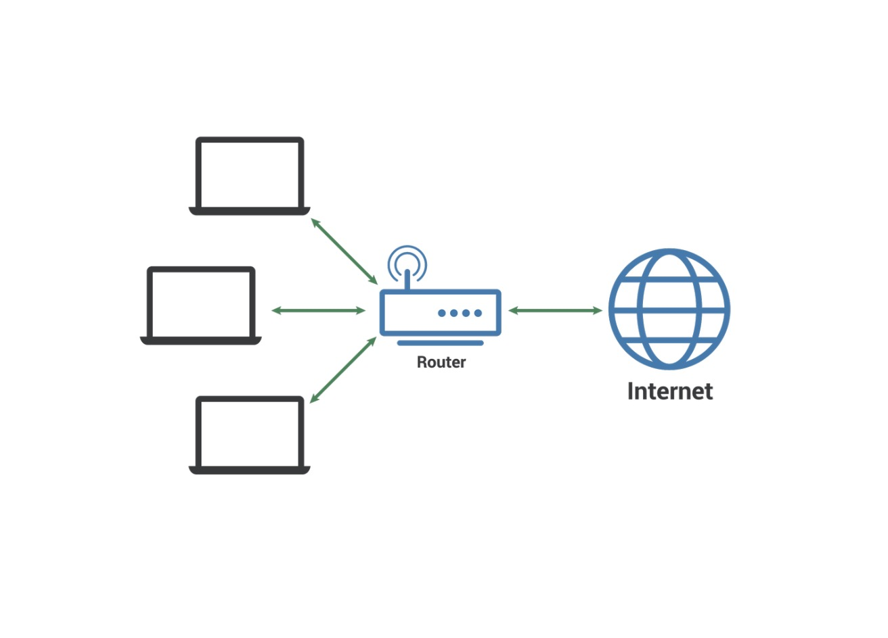
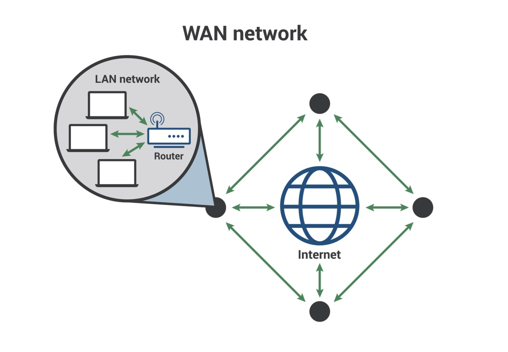
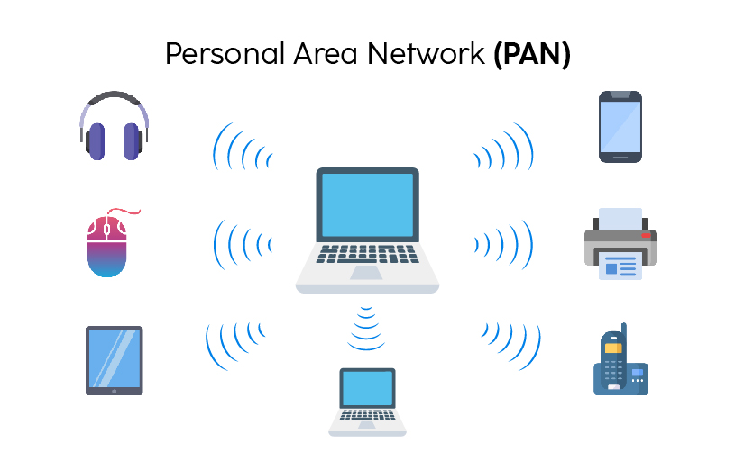

# Computer Network 101

## OSI Model

OSI Model (Open Systems Interconnection) เป็น Framework สำหรับการทำความเข้าใจว่าเครือข่ายคอมพิวเตอร์ทำงานอย่างไร มันแบ่งขั้นตอนการส่งและรับข้อมูลผ่านเครือข่ายออกเป็น 7 ชั้น
* The Physical Layer: transmitting raw data over a communication channel (data packet ที่ใช้จะเรียกว่า bit)
* The Data Link Layer: transmitting data over a physical link between two devices (data packet ที่ใช้จะเรียกว่า frame)
* The Network Layer: routing data ระหว่างอุปกรณ์บนเครือข่าย (data packet ที่ใช้จะเรียกว่า packet)
* The Transport Layer: รับรองการสื่อสารระหว่างอุปกรณ์ตั้งแต่ต้นทางถึงปลายทางที่เชื่อถือได้ (data packet ที่ใช้จะเรียกว่า segment)
* The Session Layer: establishing, maintaining, and terminating sessions between devices (data packet ที่ใช้จะเรียกว่า datagram)
* The Presentation Layer: การจัดรูปแบบข้อมูลสำหรับการนำเสนอไปยัง Application Layer (data packet ที่ใช้จะเรียกว่า message)
* The Application Layer: ให้บริการ/Interact ในลำดับของ Application (data packet ที่ใช้จะเรียกว่า message หรือ request)

## Data Communications
Data Communications หรือ การสื่อสารข้อมูล หมายถึงกระบวนการส่งข้อมูล จากอุปกรณ์หนึ่งไปยังอีกอุปกรณ์หนึ่งผ่านช่องทางการสื่อสาร การสื่อสารข้อมูลสามารถเกิดขึ้นได้ระหว่างอุปกรณ์ที่เชื่อมต่อกับเครือข่ายเดียวกันหรือระหว่างอุปกรณ์ที่เชื่อมต่อกับเครือข่ายที่แตกต่างกัน

### Simplex communication
เป็นการสื่อสารทางเดียว ตัวอย่างคือการกระจายสัญญาณโทรทัศน์

### Half-duplex communication
การสื่อสารสองทาง แต่ว่าจะส่งได้แค่ทิศทางใดได้ทิศทางนึงต่อครั้งเท่านั้น เช่นเวลาเราคุยวอล (walkie-talkie)

### Full-duplex communication
การสื่อสารสองทาง โดยส่งข้อมูลสองทางได้ในเวลาพร้อม ๆ กัน เช่นการคุยโทรศัพท์

### Common communications medium
เป็นแค่ตัวอย่างเท่านั้นนะครับ

* Copper wires: ใช้กันมากใน local area networks (LANs)
* Fiber optic cables
* Radio waves: ส่งข้อมูลแบบไร้สายทั้งทางใกล้และไกล เช่น WiFi ที่ base on wireless local area networks (WLANs) และ cellular networks ที่เราใช้กันในมือถือทุกวันนี้ (4G, 5G, etc.)
* Satellite: ดาวเทียม เป็นการสื่อสารไร้สายส่งข้อมูลระหว่างดาวเทียมและอุปกรณ์บนพื้นโลก เช่น GPS (Global Positioning System)

## Protocol
Protocol คือชุดของกฎและมาตรฐานที่ควบคุมวิธีที่อุปกรณ์ในเครือข่ายใช้สื่อสารระหว่างกัน Protocol กำหนดรูปแบบ เวลา และลำดับของ Message ที่แลกเปลี่ยนระหว่างอุปกรณ์ ตลอดจนการดำเนินการต่าง ๆ
โปรโตคอลเป็นส่วนสำคัญของระบบเครือข่าย เนื่องจากทำให้มั่นใจได้ว่าอุปกรณ์ในเครือข่ายสามารถสื่อสารระหว่างกันได้อย่างสอดคล้องและเชื่อถือได้ ตัวอย่างเช่น TCP/IP, HTTP, FTP และ DNS

## Computer Network
เครือข่ายคอมพิวเตอร์คือกลุ่มของอุปกรณ์ที่เชื่อมต่อระหว่างกันซึ่งสามารถสื่อสารระหว่างกันเพื่อแลกเปลี่ยนข้อมูลและทรัพยากร เครือข่ายคอมพิวเตอร์มีหลายประเภท ได้แก่

### Local area networks (LANs)
เป็นเครือข่ายคอมพิวเตอร์ที่ใช้ในพื้นที่ไม่กว้างมากเช่น บ้าน โรงเรียน หรือออฟฟิศเล็ก ๆ ปกติต่อกับอุปกรณ์เพื่อใช้ร่วมกันอย่าง Computers, Printers, และ Servers

### Wide area networks (WANs)
เป็นเครือข่ายคอมพิวเตอร์ที่ครอบคลุมพื้นที่ขนาดใหญ่ เช่น เมือง รัฐ ประเทศ หรือ regions WAN มักจะใช้เพื่อเชื่อมต่ออุปกรณ์ที่อยู่ไกลจากกัน เช่น คอมพิวเตอร์ที่อยู่ในเมืองหรือต่างประเทศ

### Metropolitan area networks (MANs)
เครือข่ายคอมพิวเตอร์ที่ครอบคลุมพื้นที่ทางภูมิศาสตร์ขนาดกลาง เช่น เมืองหรือพื้นที่มหานคร (Metropolitan area) MAN มักจะใช้เพื่อเชื่อมต่ออุปกรณ์ที่อยู่ภายในเมืองหรือพื้นที่มหานคร เช่น คอมพิวเตอร์ในละแวกใกล้เคียงหรือชานเมืองต่างๆ

### Personal area networks (PANs)
เป็นเครือข่ายคอมพิวเตอร์ที่ใช้ส่วนตัว อาจจะเป็นห้องเดียว หรือเปิด Bluetooth เชื่อมกันและกันในระยะใกล้ ๆ เช่น Computers, Smartphones, and Tablets

