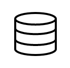
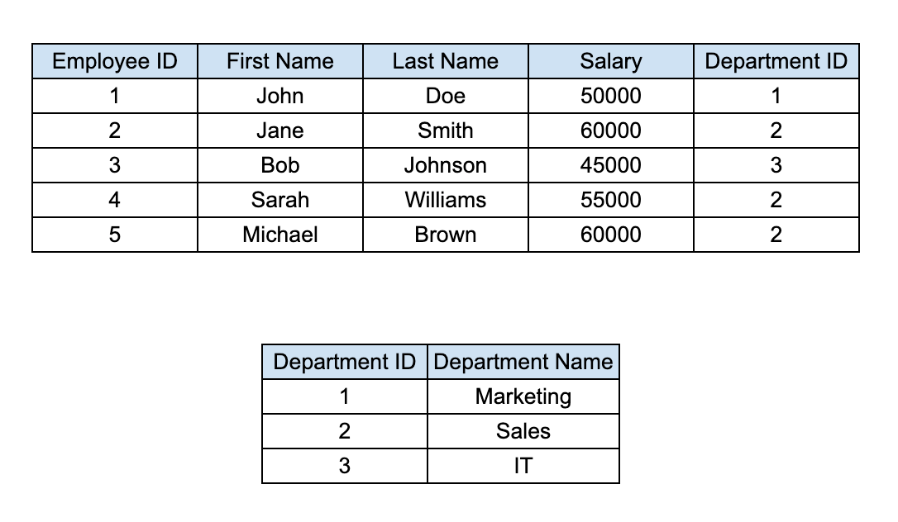

# SQL Crash course

เป็นเนื้อหาเกี่ยวกับ Database เบื้องต้นและการใช้งาน SQL

## Introduction

Database หรือ ฐานข้อมูล สมมุติว่าเราไปเจออะไรมา แล้วเราอยากจะจำเก็บไว้ เราก็เขียนลงสมุดใช่มั้ยล่ะครับ ทำนองเดียวกัน เวลาเรามี Application เราก็อยากใช้ข้อมูลที่เคยมีอยู่แล้ว หรือแม้กระทั่งต้องการที่จะเพิ่มข้อมูลใหม่เข้าไป เพื่อให้สามารถใช้งานกับ Application ของเราได้ บทนี้จะเป็นบทที่คอยสนับสนุนเนื้อหาในข้างต้นครับ

ย้อนกลับไปสมัยก่อนนู้นนนนนนน เขาเก็บข้อมูลใส่แฟ้ม ใส่ชั้น ใส่ Locker แล้วคราวนี้เวลาเขาจะหาก็หัวหมุนไปหมด มันอยู่ตรงไหนว๊าาา ก็เลยมี computer scienstists เนี่ย เขาคิดค้นเรื่องฐานข้อมูลขึ้น เพื่อให้เราสามารถที่จะเข้าถึงข้อมูลที่เก็บไว้แล้วได้ง่ายขึ้น

ฐานข้อมูลคือคอลเลกชันที่มีโครงสร้างของข้อมูลที่จัดเก็บทางอิเล็กทรอนิกส์และได้รับการออกแบบให้เข้าถึงและจัดการได้อย่างรวดเร็วและง่ายดาย สามารถใช้เก็บข้อมูลได้หลากหลาย เช่น ข้อความ ตัวเลข รูปภาพ (ใส่ได้จริง ๆ นะ แต่อย่าใส่เยอะ) และสื่ออื่นๆ

มีการใช้ฐานข้อมูลในหลากหลายอุตสาหกรรม และ Applications รวมถึงระบบการเงิน ระบบ CRM และร้านค้าปลีก เป็นเครื่องมือสำคัญในการจัดเก็บและจัดการข้อมูลด้วยวิธีที่มีประสิทธิภาพ

ตัวอย่าง Icon Database ที่เราอาจจะได้พบเห็นกันทั่ว ๆ ไป

## Relational Database Management System (RDBMS)

A relational database management system (RDBMS) เป็นระบบจัดการฐานข้อมูลประเภทหนึ่งที่มีวิธีการจัดระเบียบข้อมูลแบบความสัมพันธ์ (Relations)
RDBMS จะจัดเก็บข้อมูลในรูปแบบที่เรียกว่า Table

- Row/Record: Single Entry ภายใน Table (แนวนอน)
- Column/Field/Attribute: เป็น value ในแนวตั้งของข้อมูลแต่ละ Entry

RDBMS เป็นระบบจัดการฐานข้อมูลประเภทที่พบมากที่สุด ตัวอย่างของ RDBMS ที่เป็นที่นิยม ได้แก่ MySQL, Oracle และ Microsoft SQL Server สามารถดูเพิ่มเติมจากที่นี่ได้ครับ

**DB-Engines Ranking**

https://db-engines.com/en/ranking

### Entity-Relationship Diagram (ERD)

เป็นการแสดงแผนภาพของฐานข้อมูลที่แสดงความสัมพันธ์ระหว่าง Entity ต่างๆ ในฐานข้อมูล ERD สามารถใช้ในการออกแบบฐานข้อมูล เพื่อทำความเข้าใจความสัมพันธ์ระหว่าง Entity ต่างๆ ในฐานข้อมูล และใช้เพื่อสื่อสารการออกแบบฐานข้อมูลกับผู้อื่นเวลาทำงานร่วมกัน

#### Relations (Cardinality)

ก็คือความสัมพันธ์ ซึ่งมักจะใช้คู่กับ PK, FK เพื่อ Reference ไปที่ Table อื่น ๆ

- One-to-one: ความสัมพันธ์แบบหนึ่งต่อหนึ่งเกิดขึ้นเมื่อแต่ละแถวในตารางหนึ่งเกี่ยวข้องกับแถวเดียวในอีกตารางหนึ่ง
- One-to-many: ความสัมพันธ์แบบหนึ่งต่อกลุ่มจะเกิดขึ้นเมื่อแต่ละแถวในตารางหนึ่งเกี่ยวข้องกับหลายแถวในอีกตารางหนึ่ง
- Many-to-many: ความสัมพันธ์แบบกลุ่มต่อกลุ่มมีอยู่เมื่อหลายแถวในตารางหนึ่งเกี่ยวข้องกับหลายแถวในอีกตารางหนึ่ง

#### Example with table

ในตัวอย่างนี้ Column "Employee ID" เป็น PK และ Column "Department ID" เป็น FK ตารางนี้แสดงว่าพนักงานหลายคนสามารถอยู่ในแผนกเดียวกันได้

## SQL (Structured Query Language)

SQL (Structured Query Language) เป็นภาษาที่ใช้ในการจัดการและจัดการข้อมูลในฐานข้อมูล เป็นภาษามาตรฐานสำหรับระบบ RDBMS ใช้ในการสร้าง แก้ไข สืบค้นฐานข้อมูล และอื่น ๆ เยอะแยะไปหมด 🥺

### Common Operations

- SELECT: ดึงข้อมูลจากฐานข้อมูล
- INSERT: เพิ่มข้อมูลเข้าไปใหม่
- UPDATE: อัพเดทข้อมูลที่มีอยู่แล้ว
- DELETE: ลบข้อมูล
- JOIN: ใช้เพื่อรวมแถวจากตารางตั้งแต่สองตารางขึ้นไปตาม Column ที่เกี่ยวข้องกัน
- UNION: ใช้เพื่อรวมผลลัพธ์ของคำสั่ง SELECT ตั้งแต่สองคำสั่งขึ้นไปให้เป็นชุดผลลัพธ์เดียว

## Data Types

In SQL, each column in a table is required to have a name and a data type.

- **Numeric Types**: `INT`, `BIGINT`, `DECIMAL`, `FLOAT`, etc.
- **String Types**: `VARCHAR`, `CHAR`, `TEXT`, etc.
- **Date/Time Types**: `DATE`, `TIME`, `TIMESTAMP`, etc.
- **Boolean Types**: `BOOLEAN` or `TINYINT(1)`.

## Constraints

Constraints are rules enforced on data columns to ensure data accuracy and reliability.

- **PRIMARY KEY**: Uniquely identifies each record in a table.
- **FOREIGN KEY**: Links two tables together.
- **UNIQUE**: Ensures that all values in a column are different.
- **NOT NULL**: Ensures that a column cannot have a NULL value.
- **CHECK**: Ensures that the values in a column satisfy a specific condition.
- **DEFAULT**: Provides a default value for a column when none is specified.

## Advanced SQL Queries

### GROUP BY

The `GROUP BY` statement groups rows that have the same values into summary rows, like "find the number of customers in each country".

### HAVING

The `HAVING` clause was added to SQL because the `WHERE` keyword could not be used with aggregate functions.

### Subqueries

A subquery is a query within another query.

### Window Functions

A window function performs a calculation across a set of table rows that are somehow related to the current row.

## Transactions and ACID Properties

A transaction is a sequence of operations performed as a single logical unit of work.

- **Atomicity**: A transaction must be all or nothing. If one part of the transaction fails, the entire transaction fails.
- **Consistency**: A transaction must bring the database from one valid state to another.
- **Isolation**: Concurrent transactions must not interfere with each other.
- **Durability**: Once a transaction has been committed, it will remain so, even in the event of power loss, crashes, or errors.

## Indexing

An index is a data structure that improves the speed of data retrieval operations on a database table at the cost of additional writes and storage space to maintain the index data structure.

- **B-Tree Index**: The most common type of index. It's a balanced tree structure that keeps data sorted and allows for efficient searching, inserting, deleting, and sequential access.
- **Hash Index**: Useful for equality comparisons, but not for range queries.
- **Full-text Index**: Used for searching text-based data.

## Other resources

[Introduction to DBMS with PostgreSQL สำหรับใช้งานทั่วไป](https://youtu.be/vlOugsopjyg?si=omWNMOq2-wbhLoUS)
[Connection pooling concept บนฐานข้อมูล](https://www.youtube.com/watch?v=Y7DMN5EmVwc)
